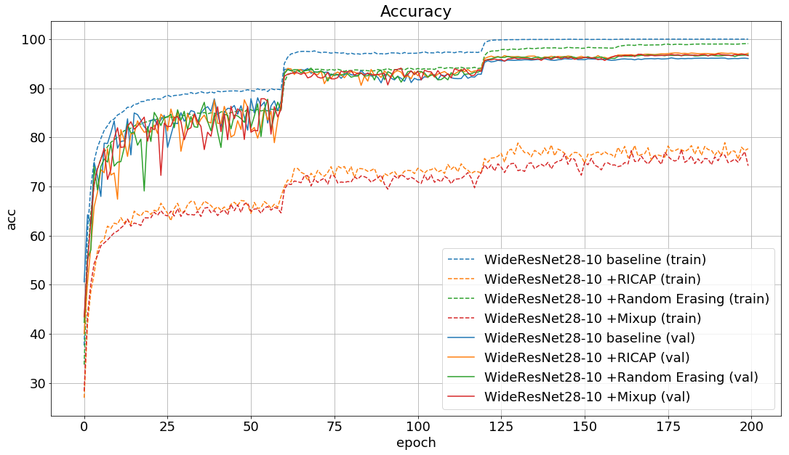

# A PyTorch implementation of RICAP
This repository contains code for a data augmentation method **RICAP (Random Image Cropping And Patching)** based on [Data Augmentation using Random Image Cropping and Patching for Deep CNNs](https://arxiv.org/abs/1811.09030) implemented in PyTorch.


## Requirements
- Python 3.6
- PyTorch 0.4

## Training
### CIFAR-10
WideResNet28-10 baseline on CIFAR-10:
```
python train.py --dataset cifar10
```
WideResNet28-10 +RICAP on CIFAR-10:
```
python train.py --dataset cifar10 --ricap True
```

## Results
| Model                                    |   Error rate (%)  |
|:-----------------------------------------|:-----------------:|
| WideResNet28-10 baseline                 |              4.70 |
| WideResNet28-10 +RICAP                   |              3.94 |
| WideResNet28-10 baseline (original paper)|              3.89 |
| WideResNet28-10 +RICAP (original paper)  |              2.85 |

Learning curves of loss and accuracy.



